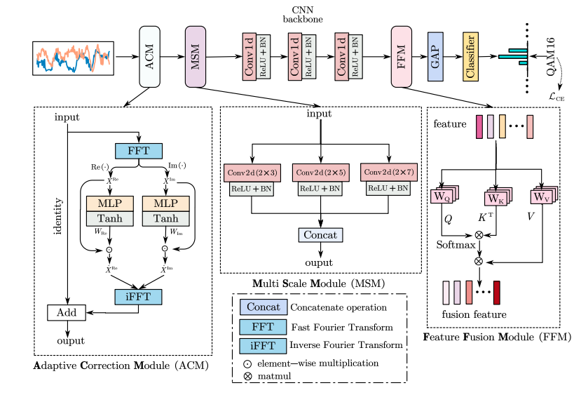
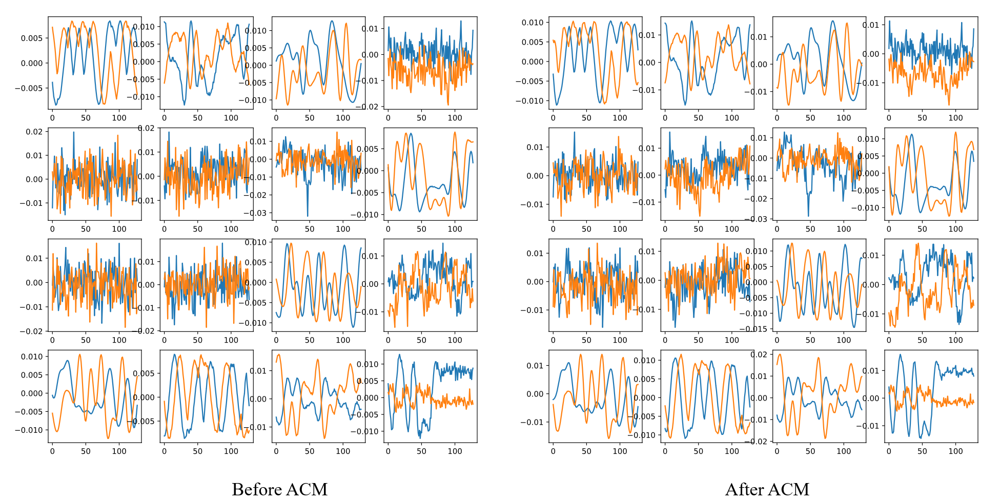
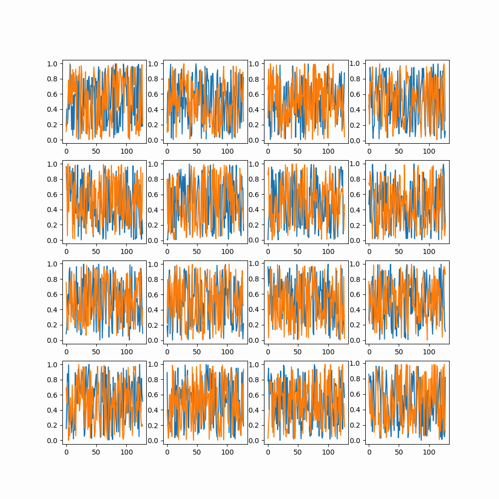

# AWN

Code for "AMC-Net: An Effective Network for Automatic Modulation Classification".

Jiawei Zhang, Tiantian Wang, [ZhixiFeng](https://faculty.xidian.edu.cn/FZX/zh_CN/index.htm), and [Shuyuan Yang](https://web.xidian.edu.cn/syyang/)

Xidian University

[[Paper](https://arxiv.org/abs/2304.00445)] | [[中文文档](doc-CN/README.md)] | [[code](https://github.com/zjwXDU/AMC-Net)] | [[poster](assets/poster.pdf)] | [[video](assets/video.mp4)]



## Preparation

### Data

We conducted experiments on three datasets, namely RML2016.10a and RML2016.10b.

| dataset     | modulation formats                                           | samples              |
| ----------- | ------------------------------------------------------------ | -------------------- |
| RML2016.10a | 8 digital formats: 8PSK, BPSK, CPFSK, GFSK, PAM4, 16QAM, 64QAM, QPSK; 3 analog formats: AM-DSB，AM-SSB，WBFM | 220 thousand (2×128) |
| RML2016.10b | 8 digital formats: 8PSK, BPSK, CPFSK, GFSK, PAM4, 16QAM, 64QAM, QPSK; 3 analog formats: AM-DSB，WBFM | 1.2 million (2×128)  |

The datasets can be downloaded from the [DeepSig](https://www.deepsig.ai/). Please extract the downloaded compressed file directly into the `./data` directory, and keep the file name unchanged. The final directory structure of `./data` should is shown below:

```
data
├── RML2016.10a_dict.pkl
└── RML2016.10b.dat
```

### Pretrained Model

We provide pre-trained models on two datasets, which can be downloaded from [Google Drive](https://drive.google.com/file/d/18RyUp-qnACE1zvmVOSjiF1jhWms0eB0Z/view?usp=share_link) or [Baidu Netdisk](https://pan.baidu.com/s/1aKlM_rj8wLYrFHXxyh8PBQ?pwd=pnxv). Please extract the downloaded compressed file directly into the `./checkpoint` directory.

### Environment Setup

- Python >= 3.6
- PyTorch >=1.7

This version of the code has been tested on Pytorch==1.8.1.

## Training & Evaluation

The whole pipeline is adopted from our another work [AWN](https://github.com/zjwXDU/AWN). You can find the details of training and evaluation in there.

## Visualize



We provide an additional mode to visualize the signal before ACM and after ACM, which can be called by the following command:

```
python main.py --mode visualize --dataset <DATASET>
```

Similar to *Evaluation*, the plotted figures are stored in `./result` in the form of `.svg`.

Surprisingly, if we input a batch of random noise, and use ACM autoregressively:



Its behavior looks like some kind of implicit generative model. This property may help to achieve online augmentation.

## Future Work

- [ ] Extend AMC-Net on RadioML2018.01a (long sequences).
- [ ] Investigate the capability of ACM.

## License

This code is distributed under an [MIT LICENSE](https://github.com/zjwXDU/AMC-Net/blob/main/LICENSE). Note that our code depends on other libraries and datasets which each have their own respective licenses that must also be followed.

## Citation

Please consider citing our paper if you find it helpful in your research:

```
@misc{zhang2023amcnet,
      title={AMC-Net: An Effective Network for Automatic Modulation Classification}, 
      author={Jiawei Zhang and Tiantian Wang and Zhixi Feng and Shuyuan Yang},
      year={2023},
      eprint={2304.00445},
      archivePrefix={arXiv},
      primaryClass={eess.SP}
}
```


Contact at: zjw AT stu DOT xidian DOT edu DOT cn
